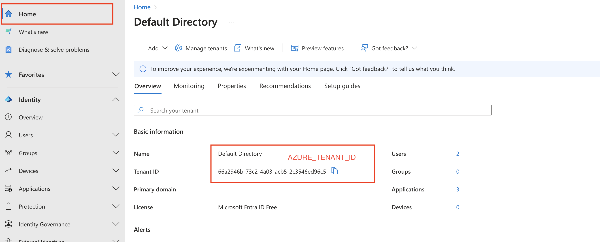
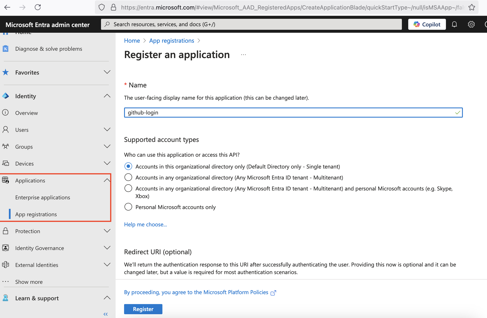
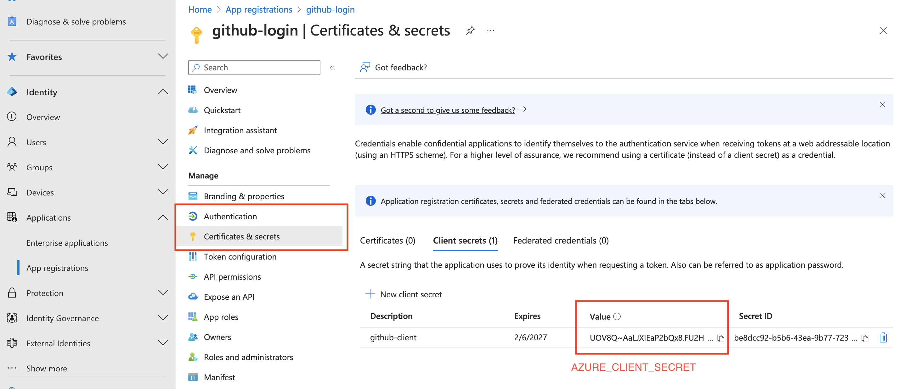
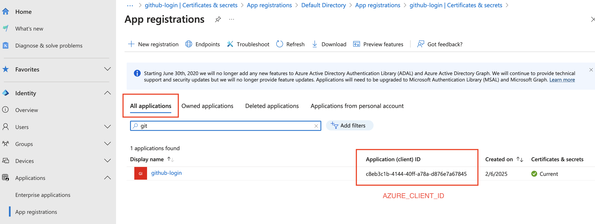
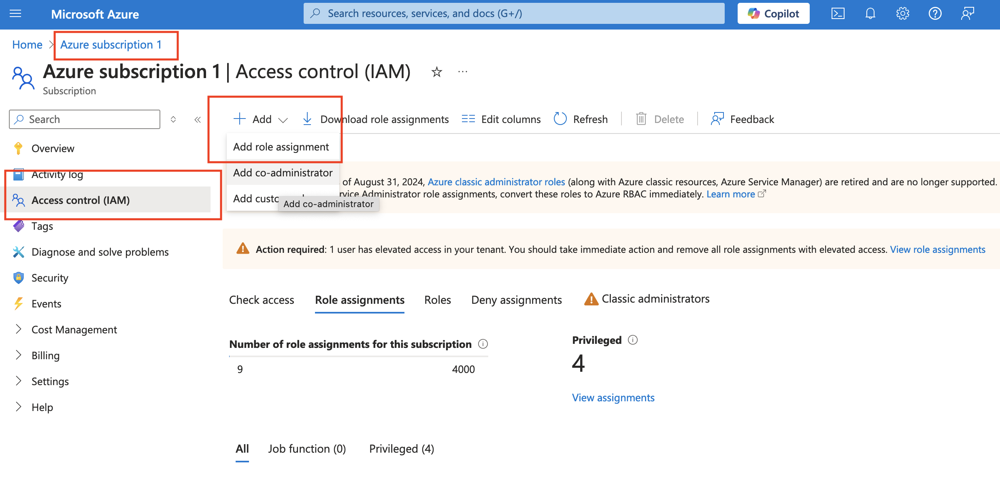
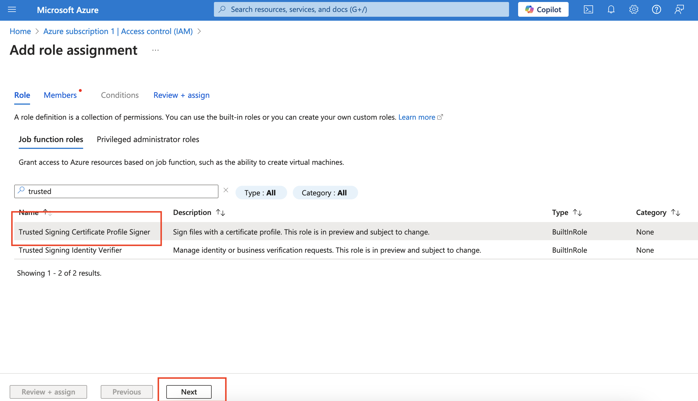
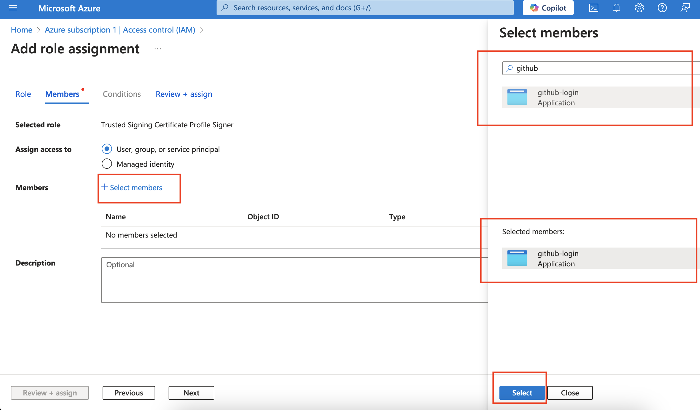
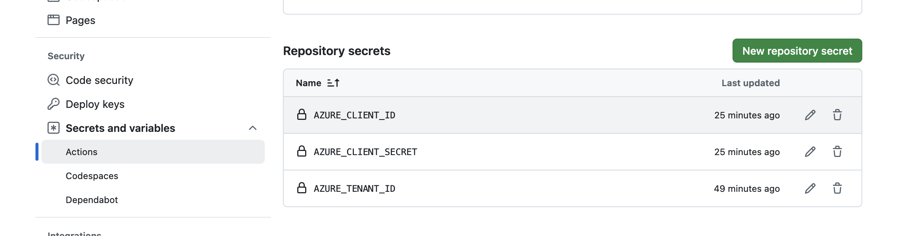

# Azure Trusted Signing

## Local Signing
### Prerequisites
- Windows 
- Azure CLI
  - install https://learn.microsoft.com/en-us/cli/azure/install-azure-cli-windows
  - authenticate: https://learn.microsoft.com/en-us/cli/azure/authenticate-azure-cli
    - `az login` or `az login --tenant <tenant_id>`
    - (optionally set you AZ subscription) `az account set --subscription <subscription_id>`
    - verify: `az account get-access-token`
- SignTool Windows 10 SDK 10.0.2261.755 or later located in `C:\Program Files (x86)\Windows Kits\10\bin\10.0.26100.0\x64` in this example: https://developer.microsoft.com/windows/downloads/windows-sdk/
- .NET 8.0 Runtime: https://dotnet.microsoft.com/download/dotnet/thank-you/runtime-8.0.4-windows-x64-installer
- Trusted Signing dlib package
  - Download https://www.nuget.org/packages/Microsoft.Trusted.Signing.Client
  - Extract to a folder (`d:\Microsoft.Trusted.Signing.Client` in this example)

### Configuration
Create `metadata.json` in `d:\Microsoft.Trusted.Signing.Client` with the following content:

```json
{
  "Endpoint": "<Trusted Signing account endpoint>",
  "CodeSigningAccountName": "<Trusted Signing account name>",
  "CertificateProfileName": "<Certificate profile name>",
  "CorrelationId": "<Optional CorrelationId value>"
}
```

```json

{
  "Endpoint": "https://eus.codesigning.azure.net/",
  "CodeSigningAccountName": "trusted-signing-alex",
  "CertificateProfileName": "alex-cert"
}
```
### Usage
```shell
"C:\Program Files (x86)\Windows Kits\10\bin\10.0.26100.0\x64\signtool.exe" sign /v /debug /fd SHA256 /tr "http://timestamp.acs.microsoft.com" /td SHA256 /dlib "D:\Microsoft.Trusted.Signing.Client\bin\x64\Azure.CodeSigning.Dlib.dll" /dmdf "D:\Microsoft.Trusted.Signing.Client\metadata.json" "d:\putty.exe"
```

## GitHub Actions

### Azure Authentication
- https://learn.microsoft.com/en-us/azure/developer/github/connect-from-azure-openid-connect
- https://learn.microsoft.com/en-us/entra/identity-platform/howto-create-service-principal-portal#register-an-application-with-microsoft-entra-id-and-create-a-service-principal

1. Record your Azure tenant ID (`AZURE_TENANT_ID` GH secret)

2. Register Entra App

3. Create and record app secret (`AZURE_CLIENT_SECRET`)

4. Record app ID (`AZURE_CLIENT_ID`)



Verify the credentials 
```shell
az login --service-principal -t <Tenant-ID> -u <Client-ID> -p <Client-secret>
az login --service-principal -t 66a2946b-73c2-4a03-acb5-2c3546ed96c5 -u c8eb3c1b-4144-40ff-a78a-d876e7a67845 -p 4Jq8Q...
```

### Role Assignment
Assign `Trusted Signing Certificate Profile Signer` role to the created Entra App




### GH Secrets
Add the following GH secrets



### Workflow
Add similar block to your release pipeline (https://github.com/marketplace/actions/trusted-signing)
```shell
      - name: Sign files with Trusted Signing
        uses: azure/trusted-signing-action@v0.5.1
        with:
          azure-tenant-id: ${{ secrets.AZURE_TENANT_ID }}
          azure-client-id: ${{ secrets.AZURE_CLIENT_ID }}
          azure-client-secret: ${{ secrets.AZURE_CLIENT_SECRET }}
          endpoint: https://eus.codesigning.azure.net/
          trusted-signing-account-name: vscx-codesigning
          certificate-profile-name: vscx-certificate-profile
          files-folder: ${{ github.workspace }}\App\App\bin\Release\net8.0-windows
          files-folder-filter: exe,dll
          file-digest: SHA256
          timestamp-rfc3161: http://timestamp.acs.microsoft.com
          timestamp-digest: SHA256
```
