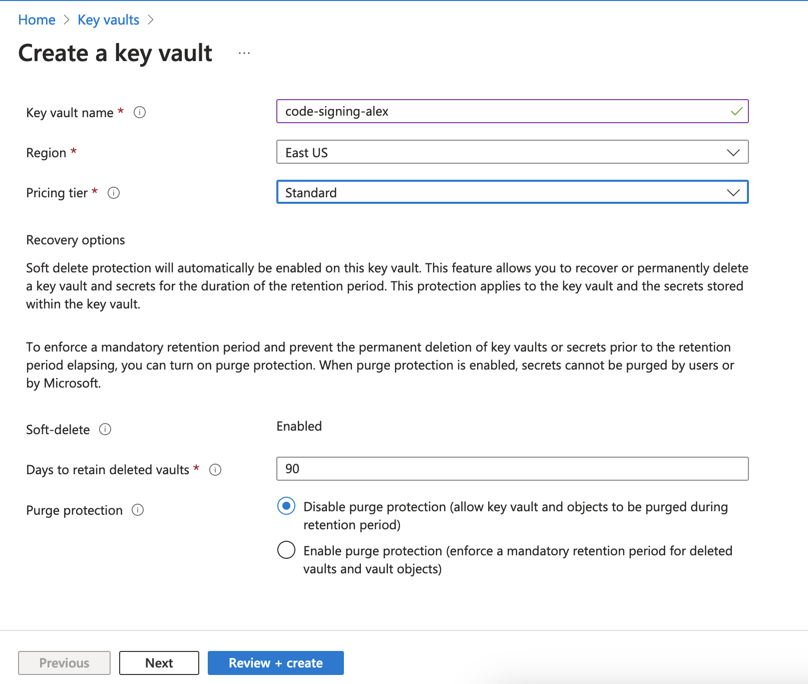

# AWS KMS + DigiCert + SignTool

## AWS KMS
### Create Private Key
https://us-east-1.console.aws.amazon.com/kms/home?region=us-east-1#/kms/keys
- Create key
- Key Type -> Asymmetric
- Key Usage -> Sign and Verify
- Key Spec -> RSA_3072 or RSA_4096
- Advanced options -> Keep defaults
- Alias -> some meaningful name

Define key usage permissions
- Key administrators - configure if required
- Key deletion -> Uncheck "Allow key administrators to delete this key"

Define key usage permissions
- Key users - configure if required

Review
- Review and approve



## Create CSR
Multiple solutions exists, I'm proposing this one - https://github.com/g-a-d/aws-kms-sign-csr:

```shell
## Clone the repo
git clone https://github.com/g-a-d/aws-kms-sign-csr
cd aws-kms-sign-csr/

## Install
python3 -m venv aws-kms-sign-csr
source aws-kms-sign-csr/bin/activate
pip3 install -r requirements.txt

## Use
# generate a PEM csr - the key doesn't matter as it will be replaced
# Make sure to adjust the key length
openssl req -new -newkey rsa:3072 -keyout /dev/null -nodes -out test.csr

# Replace the CSR public key (and sign it with corresponding private key)
# Adjust the parameters and configure access credentials
./aws-kms-sign-csr.py --region us-east-1 --keyid cb926c90-29b4-4b4e-af38-060a49518fd2 --hashalgo sha256 test.csr > new.csr
```

## Submit the CSR to DigiCert/another CA
Out of score. Use the `new.csr` produced on the previous step

### Issue self-signed certificate for testing
See `self-signed.py`

## Use
### JSign

```shell
jsign --storetype AWS \
       --keystore us-east-1 \
       --storepass "AKI...|ZkPAWkwbot..." \
       --alias cb926c90-29b4-4b4e-af38-060a49518fd2 \
       --certfile chain.pem application.exe

#        --storepass "<access-key>|<secret-key>|<session-token>" \
```

### aws-kms-pkcs11 + SignTool or other tool
https://github.com/JackOfMostTrades/aws-kms-pkcs11
