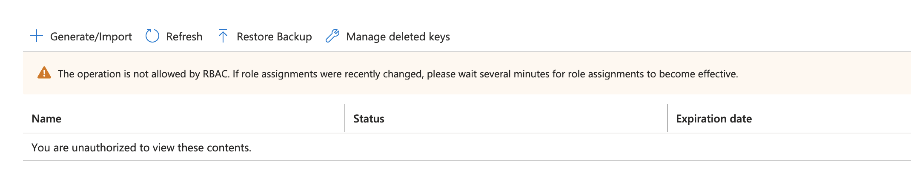
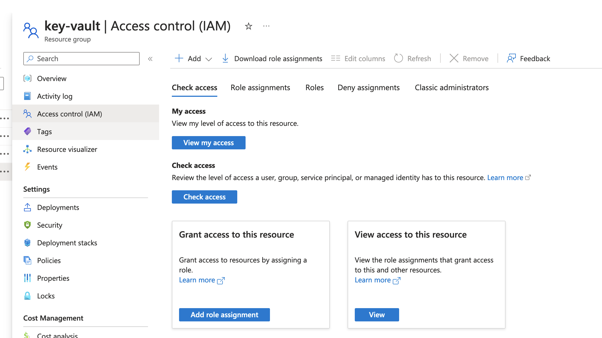
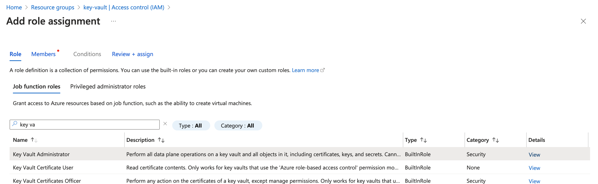
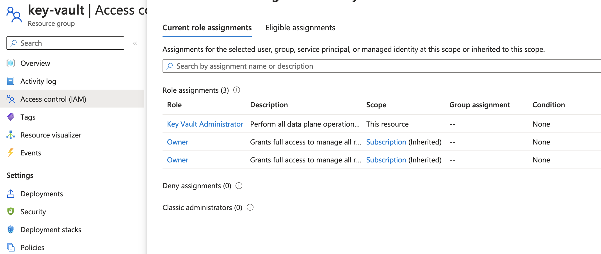
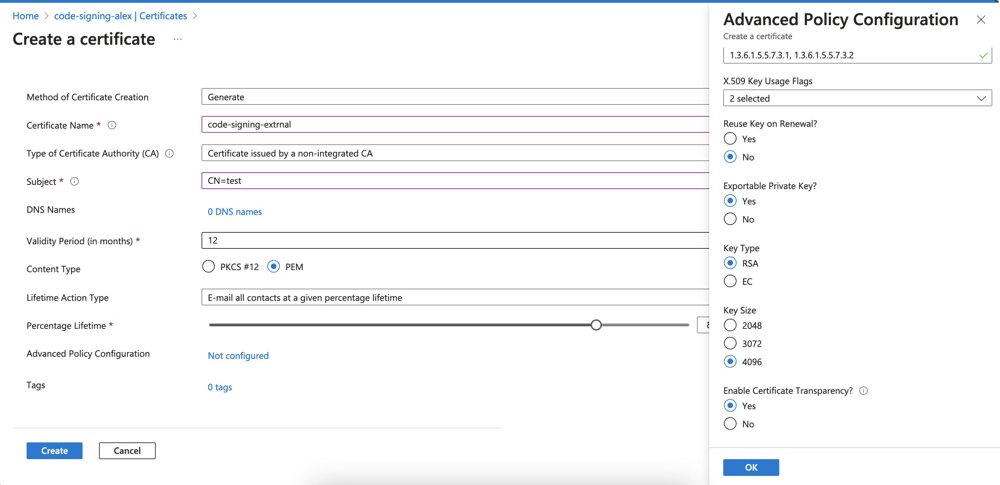
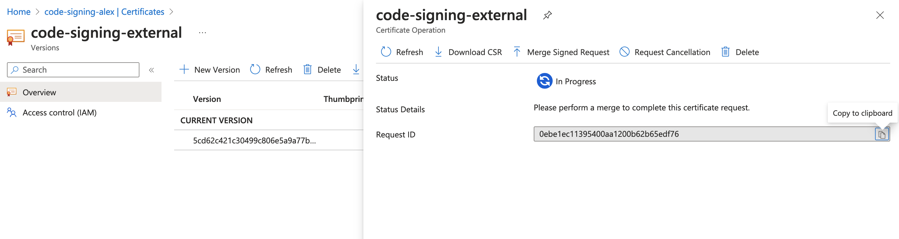
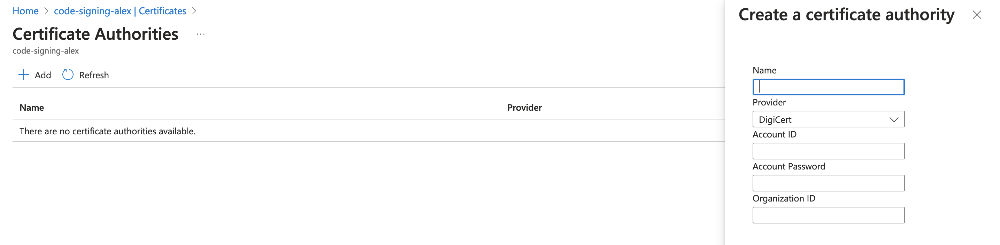
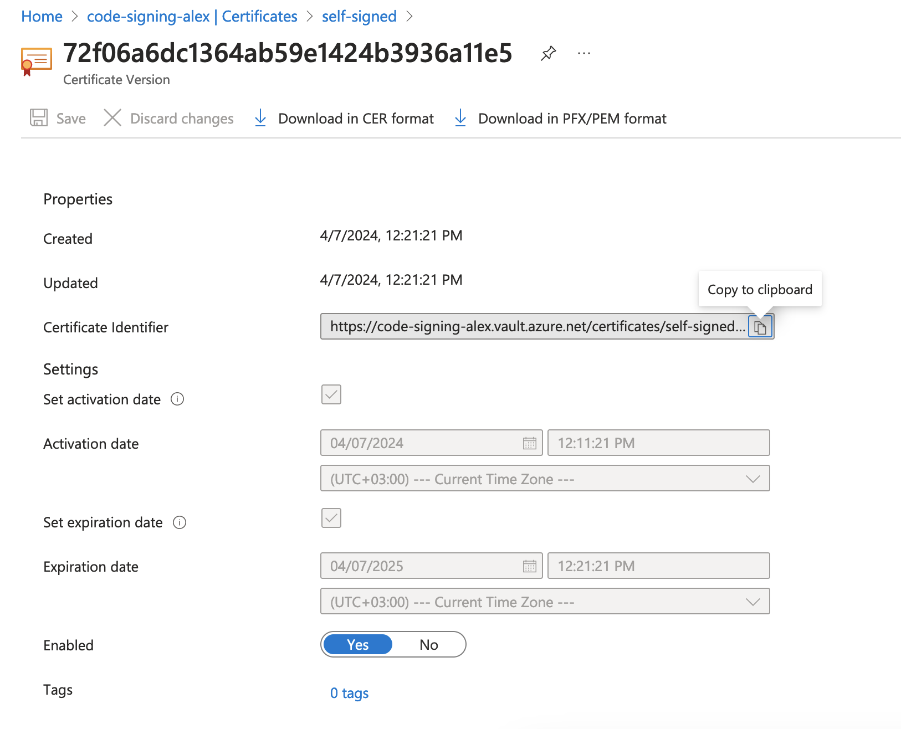

# Azure Vault + DigiCert + SignTool

## Azure Vault
### Create Private Key
Create key vault  
Make sure to use the HSM option for production usage

Assign IAM Role to your user  
If you are getting this error during key/certificate creation,
this means you need to assign the `Key Vault Administator` role to your account  
https://learn.microsoft.com/en-us/answers/questions/1370440/azure-keyvault-the-operation-is-not-allowed-by-rba

Navigate to the resource group's corresponding to the key vault  IAM. Click `Add Role Assignment`

Find `Key Value Administrator` role and assign it to your user

Check current role assignments to verify the new configuration

Create key/certificate
There's an option to create either a key or a certificate (key + certificate). We're going to the certificate option  
Make sure to adjust the details under the Advanced Policy Configuration

### Create CSR
There's an option to either manually create and submit a CSR to a CA of your choice
or use a built-in connector to a selected CAs (Digicert and GlobaSign as of April 2024)

Use the 'Merge Signed Request' to submit a CA-issued certificate once you receive it 

### Issue a self-signed certificate for testing

You may issue a self-signed certificate direcly in Azure UI or use a tool of your choice (example?)

## Use with AzureSignTool

You may use AzureSignTool or jsign, but not Windows signtool

https://stackoverflow.com/questions/57475144/how-to-sign-code-built-using-azure-pipelines-using-a-certificate-key-in-azure-ke

https://github.com/vcsjones/AzureSignTool

## Links
- https://signmycode.com/azure-key-vault-ev-code-signing