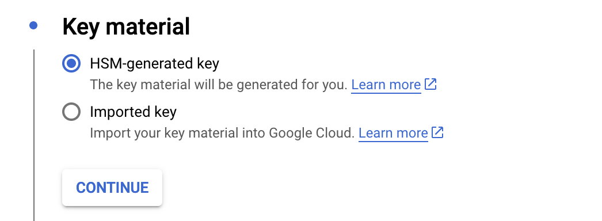

# GCP KMS + DigiCert + SignTool
[Step by step guide for setting up GCP + Digicert + SignTool](DIGICERT_GCP_KMS.md)

## Google KMS
### Create Private Key

1. Enable KMS API https://console.cloud.google.com/apis/api/cloudkms.googleapis.com/metrics
2. Create a keyring https://console.cloud.google.com/security/kms/keyrings


3. Create a private key





### Configure Access Credentials (Service Account)

https://console.cloud.google.com/iam-admin/serviceaccounts/create

This is service account and key are going to be used as access credentials on CI machines.
Don't be confused with the private key used for signing 


## Create CSR

### OpenSSL on GCP VM

You need a temporary GCP Debian 11 VM

https://cloud.google.com/kms/docs/reference/pkcs11-openssl

```
sudo apt-get update
sudo apt-get install libengine-pkcs11-openssl

wget https://github.com/GoogleCloudPlatform/kms-integrations/releases/download/pkcs11-v1.4/libkmsp11-1.4-linux-amd64.tar.gz
tar -xvzf libkmsp11-1.4-linux-amd64.tar.gz
sudo mv libkmsp11-1.4-linux-amd64 /opt/

export PKCS11_MODULE_PATH="/opt/libkmsp11-1.4-linux-amd64/libkmsp11.so"

cat >> /opt/libkmsp11-1.4-linux-amd64/pkcs11-config.yaml << EOF
---
tokens:
  - key_ring: "projects/alex-sc-test/locations/us/keyRings/code-signing-keyring"
EOF

chmod 0700 /opt/libkmsp11-1.4-linux-amd64/pkcs11-config.yaml

export KMS_PKCS11_CONFIG="/opt/libkmsp11-1.4-linux-amd64/pkcs11-config.yaml"

```

```
openssl req -new -subj '/CN=test/' -sha256 -engine pkcs11 -keyform engine -key pkcs11:object=code_signing_key_2024 > csr.txt
```

```
cat csr.txt
-----BEGIN CERTIFICATE REQUEST-----
MIIEVDCCAjwCAQAwDzENMAsGA1UEAwwEdGVzdDCCAiIwDQYJKoZIhvcNAQEBBQAD
ggIPADCCAgoCggIBAKSXzKFZ/+mx0i6s5fVVIfbDTz7P66BXk3tuXWcI9I1mOcnt
2C/9VS695AWOd7GsgnojtURQrwcczv5w08FKX0TJcMovweSJKEjYbcI8A+fb4X22
NMch6OaY93WwdvVfyq/coKX8k2Ana/+yZVGfzUX8D1yNt/+/QVI12UjJi2Hgq8cC
OVTfhM+bI7PysNaBs/z1PAYChp5PUl7xJVRfpF7mylypms18uT5u5+wngPrTl9cX
pDQSr9k4n5MBlB8z6ibIDgUrSeT6NFtIICcy1IQk54jDjOvRid+Tmlb7c7PB+srK
3pG5xR1BpMSMBQlPnI1pSX3QSBM83J4figRHh5zcohPrk6axczTfXPzCDI33ZHO0
iIrV6sqF1oF7Qk1bj15EEIP5xMNnD/UGKpoLl5hu1nFSCQJNArefppYdAalG1RFG
/RuhQuxnUiqqMGWwa7YSTW9yt59z7FL53Df2KOXDSA7dwZj3Zpojp+HftEZKOfiR
gKoczD2fG6OW6E6VMUI84hFeIXJAfFtOUtTHdHehLEhf5wHmgCLW3RAu43QLeLI9
RTyoGAI30EAKhGBoITvjiz07vE534YqIT/nrmJmeOfnVx74q6QrmDshB5O6Nq+qz
i/aAsDMaUF7YnSu73LdYTzf9AltqeR/VBfZ3kDPaYAo+4mE5DpeYRhWZhNL/AgMB
AAGgADANBgkqhkiG9w0BAQsFAAOCAgEAKyfiiQOxaGg4NPUTMrYh/wrwPbGidUQ8
pdCN+ZZLVQJL8N/n0iL9+uKr2Kb/ggeJ9eULhBj8iaGU7oUi7RcIorOgNvbv7M0Y
4zie6xpH4ES9cB0zmCwJ5hMyy7846DrKe3ASkuH4QJBT0jEvAXhIm3krlIyq7C4b
AwXL3SD+o0U5cm3276fC/DL8IMjVt2D7z8m0JTdYk3zMU2wk6tBmodM0LqHRc8fO
1IlmA58BSYd90jaV/+wif+ikwy/WnEP9UfqRKI/skNC5lnwOpLU3I0mLNzm+ipnH
n5d42jIil0L9XGEHKUnkD6IieHM1nm1n2+wfPJM4uRuQQebySHAdIjbW9umZN5tZ
JbszdAHe3IDH5g7Nl18KM+ujVN8Srd+JIBx58xdmqdIihi0WYk/Hl7fjpZjhuZHQ
J9QY2jbfCEqU9WY+4kI8+1BxIOxB96/z6VUuqzgcVe7QnzFk2R4MySYxiu5G02uW
3Qu0ZFtw75qtjNYuKbL3Qzud3r37fAahSmjQLkvUKyagZxruiZnk+fAq+H6s/+v1
oCz31tNRVZbF1Mk017gYDpSIPeYcYtxDgZiIbBLRe4mXa+WDA9tq1DwbaEoEybFk
YH73n0y9ocyjRoOVsuzPRwACAGCw7DgMm+81SDq18+zWin8/okFtjEQhEj5nJNok
qeUrM/JcpEk=
-----END CERTIFICATE REQUEST-----
```


#### Issue a self-signed certificate for test purposes
`openssl req -new -x509 -days 3650 -subj '/CN=test/' -sha256 -engine pkcs11 -keyform engine -key pkcs11:object=code_signing_key_2024 > gcp-test-certificate.crt`


#### Debug
`openssl engine pkcs11 -t -c`

```
sudo apt-get install opensc

export PKCS11_MODULE_PATH=/usr/lib/x86_64-linux-gnu/pkcs11-spy.so
export PKCS11SPY="/opt/libkmsp11-1.4-linux-amd64/libkmsp11.so"

# Optional, stderr will be used for logging if not set
export PKCS11SPY_OUTPUT="/path/to/pkcs11-spy.log"
```

### Using Python code
Could be added if needed

## Submit the CSR to DigiCert

https://order.digicert.com/step1/code_signing

## Use with SignTool

https://cloud.google.com/kms/docs/reference/cng-signtool

- Install CNG Provider (https://github.com/GoogleCloudPlatform/kms-integrations/releases/download/cng-v1.1/kmscng-1.1-windows-amd64.zip)  
  https://github.com/GoogleCloudPlatform/kms-integrations/blob/cng-v1.1/kmscng/docs/user_guide.md
- Add `C:\Windows\KMSCNG\config.yaml` with the following content:
```yaml
---
resources:
  - crypto_key_version: "projects/alex-sc-test/locations/us/keyRings/code-signing-keyring/code_signing_key_2024/cryptoKeyVersions/1"
```
- Copy GCP credentials (service account key) into `~\AppData\Roaming\gcloud\application_default_credentials.json`
- Sign
```bash
"c:\Program Files (x86)\Windows Kits\10\bin\10.0.22621.0\x64\signtool.exe" sign /v /debug /fd sha256 /t http://timestamp.digicert.com /f gcp-test-certificate.crt /csp "Google Cloud KMS Provider" /kc projects/alex-sc-test/locations/us/keyRings/code-signing-keyring/cryptoKeys/code_signing_key_2024/cryptoKeyVersions/1 d:\putty.exe
```

### Debug
Missing GCP credential
```
W0407 06:13:02.514961   19024 logging.cc:41] [external/com_github_grpc_grpc/src/core/lib/security/credentials/google_default/google_default_credentials.cc:412]: Could not create google default credentials: UNKNOWN:Failed to load file {filename:"C:\\Users\\...\\AppData\\Roaming/gcloud/application_default_credentials.json", created_time:"2024-04-07T06:13:02.4490507+00:00", children:[UNKNOWN:No such file or directory {created_time:"2024-04-07T06:13:02.4489689+00:00", errno:2, os_error:"No such file or directory", syscall:"fopen"}]}
```

## References
- https://signmycode.com/resources/how-to-set-up-ev-code-signing-on-google-cloud-hsm
- 